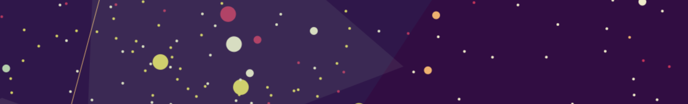
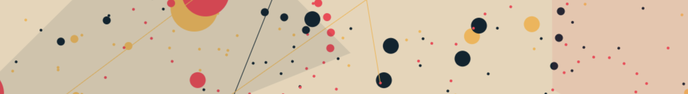

# circles

colourful animated circles with random palettes: [wcarss.ca/circles](https://wcarss.ca/circles)





# what causes such beauty

Marvin Minsky found that a fairly simple transformation that approximates circular motion:

```js
x = x – (y >> 4)
y = y + (x >> 4)
```

when split across 3 points, causing each of their motions to tug on the others:

```js
ya = ya + ((xa + xb) >> sh0);
xa = xa - ((ya - yb) >> sh1);
yb = yb + ((xb - xc) >> sh2);
xb = xb - ((yb - yc) >> sh3);
yc = yc + ((xc - xa) >> sh4);
xc = xc - ((yc - ya) >> sh5);
```

results in wild spirals and swooping arcs, rather than simple circles. The shN variables above are numbers from 0-8, and different values for those produce interestingly different results in the plotted points.

By then wrapping all of the resulting coordinates into a specific range, they overlap and interact with each other repeatedly, forming a nice base for some generative art. And then you put in nice colours, some randomness for sizes and shapes, and set the whole thing slowly twirling!

# credits

- as always, [Matt DesLauriers](https://www.mattdesl.com/) whose [art project audiograph](https://www.audiograph.xyz/) got me started on things like this, and whose palettes I've used repeatedly, including here.
- The [online Minskytron](https://www.masswerk.at/minskytron/) which implements this logic as it would have been seen back in the day, with many cool presets, and great explanations how the transformations used here actually work.
- the synth setup is taken from https://github.com/mezoistvan/discreetmusic, who credits this absolutely amazing blog post deconstructing and recreating works of Brian Eno's, by teropa: https://teropa.info/blog/2016/07/28/javascript-systems-music.html
